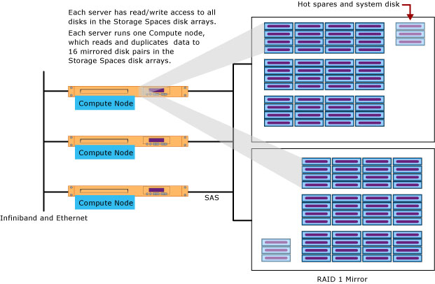

# Analytics Platform System hardware components

Analytics Platform System (APS) uses scalable components so that you can buy the right amount of processing and storage according to your business requirements. When you order APS, you will need a combination of these core hardware components. Specific hardware vendors might use different naming conventions or have additional components.  
 
  
## Rack and network 
 
APS components are all stored in one or more racks that fit into your data center. Each rack comes with power distribution units (PDUs), two InfiniBand switches, and two Ethernet switches.  
  
  
  
## Data Scale unit
 
A Data Scale unit contains the data hosts and direct attached storage (DAS) for processing and storing user data. To add capacity you add Data Scale units according to configurations that are supported by your hardware vendor. As the number of Data Scale units grows, you need to add additional Rack & Network components, as necessary, to provide more power, network, and rack infrastructure.  
  
### Data host  

A data host is a server dedicated to processing user data. Parallel Data Warehouse (PDW) runs one Compute node on each data host. For HPE appliances, the Data Scale unit has two data hosts. For Dell and Quanta appliances, the Data Scale unit has three data hosts.  
  
### Direct attached storage
 
The direct attached storage (DAS) is a pool of disks connected to the data hosts. All of the data hosts can access any of the disks. As part of the shared nothing architecture, the Compute nodes running on the data hosts do not share individual disks. However, for high availability, the storage access is shared and each of the data hosts can access any of the disks.  
  
### Data Scale unit architecture - DELL and Quanta
  
  
  
### Data Scale unit architecture - HPE 
 
  
  
### Data scale unit description

A Data Scale unit has one server (host) for each Compute Node and one direct-attached disk array that is attached with Serial Attached SCSI (SAS). Within the storage cabinet, the disk array is divided into two halves that each have redundant power supplies. Windows Server Storage Spaces manages user data by duplicating data across RAID 1 mirrored disk pairs. The disks in each disk pair are stored in different halves of the disk array.  
  
The disk array also contains hot spare disks and a system disk. If a disk fails, Storage Spaces uses the good copy of the data on the functioning disk to rebuild a duplicate copy of the data on a hot spare. This is an important self-healing capability that helps to protect against data loss.  
  
The total number of disks for the Compute nodes:  
  
-   DELL has 96 disks = (3 servers) * (16 disks per server) \* (2 for redundant disks).  
  
-   HPE has 64 disks = (2 servers) * (16 disks per server) \* (2 for redundant disks).  
  
-   In addition, each disk array has hot spare disks and a system disk.  
  
**For high availability**, when a Compute node fails over it can still function and access its user data through the other host in the Data Scale unit. At least one of the direct attached physical hosts MUST be functioning or data access to the storage is lost.  
  
**For disk sizes**, the direct attached storage can have 1, 2, or 3 Terabyte disk drives. All Data Scale units must have disks of the same size.  
  
## Base Scale unit 
 
The Base Scale unit contains the minimum number of brain-power hosts, data hosts, and direct attached storage that is required for the appliance. It includes these components.  
  
### orchestration host  
This server runs the brains of PDW.
  
### passive host  
This server provides high availability. It is online and ready to run jobs in case there is a failure on the orchestration or data host. The orchestration host, passive host, and Data Scale unit servers are configured as a Windows failover cluster. Each rack in the appliance requires one passive host.  
  
### optional passive host  
To add further redundancy, you have the option to add a second passive host to the Base Scale unit.  
  
### Data Scale unit  
The Base Scale unit includes one Data Scale unit which is placed at the bottom of the rack.  
  
This diagram shows the Base Scale unit plus the Rack and Network. This is the minimum configuration for an Analytics Platform System appliance.  
  
  
 
