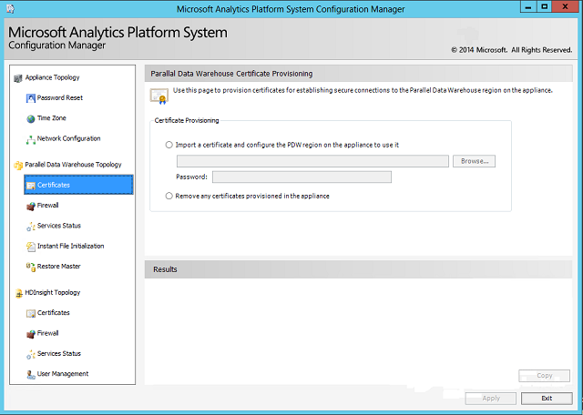

# PDW Certificate Provisioning
The **PDW Certificate Provisioning** page of the Analytics Platform System**Configuration Manager** imports or removes the certificate used by the PDW region. Using, a certificate to encrypt connections can help secure communication to the Control node through SQL Server clients, tools that use the SQL Server PDW drivers, the [Admin Console](monitor-the-appliance-by-using-the-admin-console.md), and Integration Services loads.  
  
## Prerequisites  
Before installing the certificate, do the following:  
  
1.  Obtain a secure certificate. If you need more information about how to obtain a secure certificate, contact Microsoft Support.  
  
2.  Save the certificate to the Control node in a password-protected PFX file.  
  
## For Security Reasons, Obtain a Trusted Certificate  
SQL Server PDW supports using a certificate to encrypt connections to the Control node; including connections to the **Admin Console**.  
  
By default, the **Admin Console** includes a self-signed certificate that provides privacy, but not server authentication. This can leave communications vulnerable to a man-in-the-middle attack. When a user connects to the Admin Console by using the self-signed certificate, Internet Explorer returns the error: “There is a problem with this website's security certificate”.  
  
Although the connection through the self-signed certificate encrypts in-flight data between the client and the server, the connection is still at risk from attackers.  
  
> [!WARNING]  
> Appliance administrators should immediately acquire a certificate that chains to a trusted certificate authority recognized by clients, in order to have a secure connection and remove the error that Internet Explorer reports.  
  
The certification path must contain the fully qualified domain name that maps to the Control node Cluster IP Address (recommended) or the name that users type into their browser address bars to access the **Admin Console**.  
  
Use the Analytics Platform System**Configuration Manager** to add or remove the trusted certificate. Directly using the Microsoft Windows HTTP Services Certificate Configuration Tool (**winHttpCertCfg.exe**) to manage the certificate is unsupported.  
  
## Import or Remove the Certificate  
The following instructions show how to import or remove the appliance certificate.  
  
### To import the certificate  
  
1.  Launch the **Configuration Manager**. For more information, see [Launch the Configuration Manager &#40;Analytics Platform System&#41;](launch-the-configuration-manager.md).  
  
2.  In the left pane of the **Configuration Manager**, expand **Parallel Data Warehouse Topology**, and then click **Certificates**.  
  
3.  Select **Import a certificate and configure the appliance to use it**, and then click **Browse** to browse to and select the certificate file.  
  
4.  Enter the password for the certificate in the **Password** field.  
  
5.  Click **Apply** to configure the certificate for the appliance.  
  
SQL Server PDW will not encrypt current connection by using the imported certificate, but will use the certificate for new connections.  
  
### To remove the previously imported certificate  
  
1.  Launch the **Configuration Manager**. For more information, see [Launch the Configuration Manager &#40;Analytics Platform System&#41;](launch-the-configuration-manager.md).  
  
2.  In the left pane of the **Configuration Manager**, expand **Parallel Data Warehouse Topology**, and then click **Certificates**.  
  
3.  Select **Remove any certificate provisioned in the appliance**.  
  
4.  Click **Apply** to remove the previously imported certificate from the appliance.  
  
SQL Server PDW will continue to encrypt current connections, but will not use the removed certificate for new connections.  
  
  
  
## See Also  
[Launch the Configuration Manager &#40;Analytics Platform System&#41;](launch-the-configuration-manager.md)  
<!-- MISSING LINKS [HDInsight Certificate Provisioning &#40;Analytics Platform System&#41;](hdinsight-certificate-provisioning.md)  -->  
  
