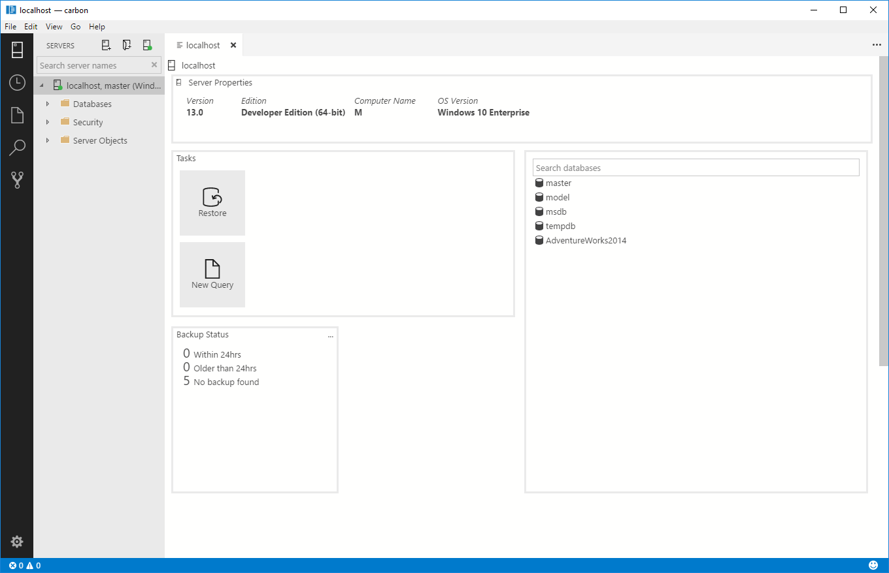

# Dashboards in [!INCLUDE[name-sos](../includes/name-sos-short.md)]

To view a dashboard, right-click a server, or database and select **Manage**.



**Server Properties**
Contains the properties of the server, including Version, Edition, Computer Name, and OS version.

**Tasks**
Contains commons tasks such as Restore and New Query.

**Search Databases**
Easily look up existing databases stored on the server, including tables.

**Backup Status**
Easily look up the backup status for existing databases.

## Configuring Insight Widgets
It is highly recommended that you follow the tutorial for setting up your dashboard, which can be found [here](tutorial-build-custom-insight-sql-server.md).

In addition, make sure to check out the [How-To on configuring insight widgets]().

After following this tutorial, read on to learn more about specific widgets that are not covered in the tutorial.

## Insight Detail
The Insight details flyout provides more detailed information for a related insight widget. 
- An Insight widget renders an at-a-glance summary view with count, line, chart etc. 
- The Insight details flyout provides "drill in" details, listing deeper data insights for each item listed in the high-level Insight widget. 
  - The details flyout contents are defined with a separate SQL query to the main widget's query. 

There is no set requirement for an Insight details query, but the layout is standard.
- The top half of the view is always a 2-column "summary" view. Which columns to use are defined by the "label" and "value" properties of the JSON configuration
- On clicking on a row in the summary table, the bottom half of the flyout will list the full set of column information for that row.

### Insight Detail configuration in package.json

Sample Insight Details flyout configuration
```json
"details": {
    "queryFile": "./relative_path_to_sqlfile_from_package_json_file.sql",
    "label": {
        "icon": "database",
        "column": "first_column_name_for_summary_list_view",
        "state": [
            {
                "condition": {
                    "if": "equals",
                    "equals": "0"
                },
                "color": "red"
            },
            {
                "condition": {
                    "if": "equals",
                    "equals": "1"
                },
                "color": "orange"
            },
            {
                "condition": {
                    "if": "equals",
                    "equals": "2"
                },
                "color": "green"
            }
        ]
    },
    "value": "second_column_and_condition_check_value_column_for_summary_list_view",
```
|property|type|value|default value|description|comment|
|:---|:---|:---|:---|:---|:---|
|details|json object|||mandatory proerty to define insight detail definitions within its structure||
|queryFile|string|||the insight detail sql query file path and filename relative to the location of package.json||
|label|json object|||mandatory property to define each line item in the summary list view|in future the name of this property to change like 'summaryList'|
|icon|string|||indicate the icon name to reder for each summary list view item.|(tbd) list of supported icons will be documented|
|column|string|||indicate the name of first column in the summary list view from the query result set|in future the name of this property will be changed to more intuitive name|
|value|string|||indicate the name of second column in the summary list view from the query result set. The value of this column is used to check conditions and set color for each summary list view items's color dot|in future the name of this property will change to something more intuitive|
|condition|json object|||defines the condition check for column value and determine color for each summary list view item||
|if|string|always, equals, notEquals, greaterThan, lessThan, greaterThanOrEqauls, lessThanOrEquals||condition check operator|in future the property name will change to operator|
|equals|string|||condition check value|in future this property name will change to 'value'|

## Insight Actions
With an insight widget and insight details, you can easily come up an action plan to mitigate an issue or manage. For example, you will think of executing DBCC CHECKDB, read error logs or Restore the database when a database is in a recovery pending. Or it can be any of actions that you wish to perform.

Using [!INCLUDE[name-sos](../includes/name-sos-short.md)]'s Insight Actions configuration, you can map a built-in actions like restore, or bring your own action defined with a sql script.

> Configuration of custom actions using sql script is under development and it is not available in the private preview build yet.

## Sample Insight Action definition

```"actions"{}``` defines an insight action. Action can be defined over a specific scope such as ```"server"```, ```"database"``` and so on and [!INCLUDE[name-sos](../includes/name-sos-short.md)] passes the current connection context information to the action. 

For example, when restore action is launched for WideWorldImporters database, ```"database": "${Database}"``` definition indicates to pass ```Database``` column value in your query result to the restore action. Then restore action starts for the database. ```"types"``` is a json array and multiple actions can be listed in the array. It basically becomes a context menu on Insight Details dialog that user can click and perform the action. 

> [!INCLUDE[name-sos](../includes/name-sos-short.md)] preview 0.17.1 has enabled "backup", "restore", "new-query" and "new-database" as action types.

```json
"details": {
    "queryFile": "./sql/database_state_detail.sql",
    "label": {...},
    "value": "state",
    "actions": {
        "database": "${Database}",
        "types": ["restore"]
    }
}
```
